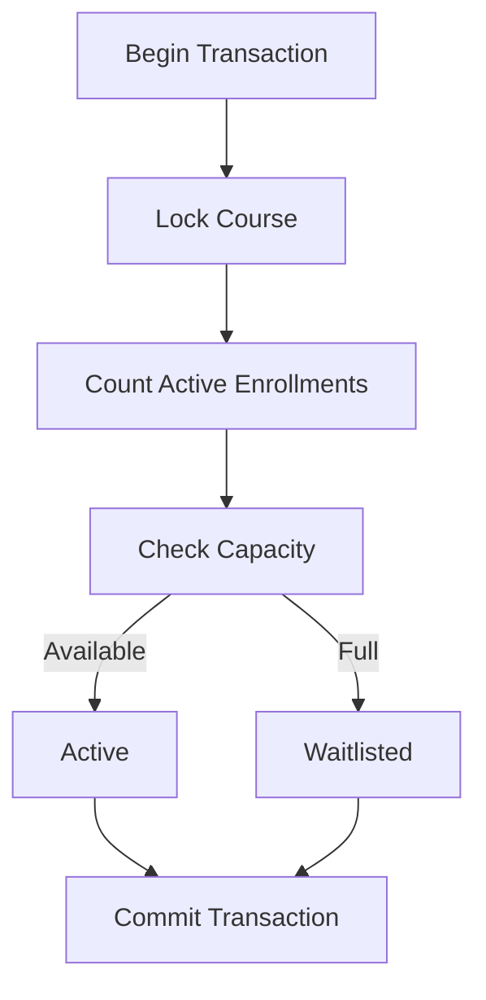
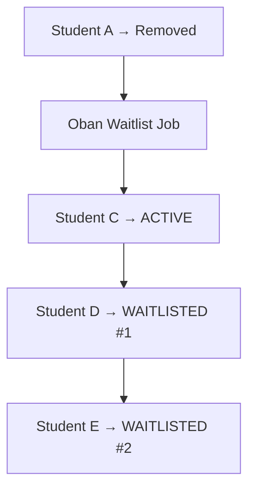
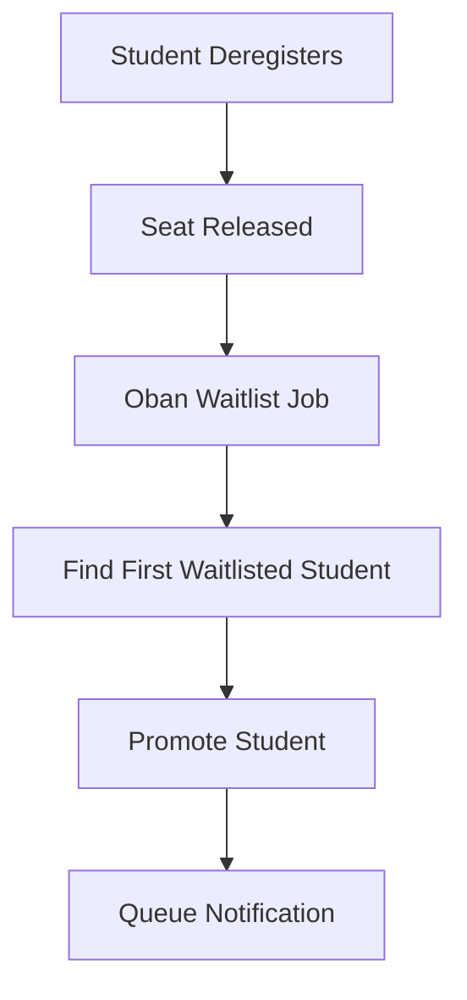
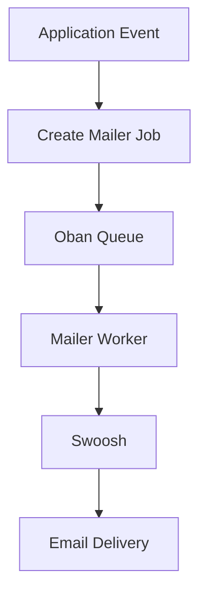
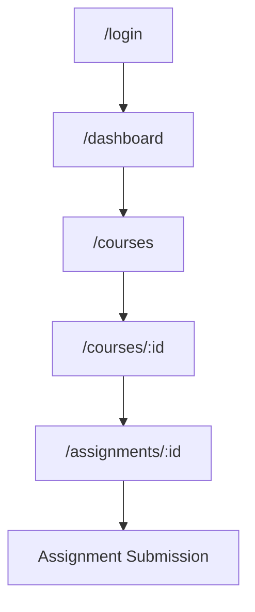

# System Architecture

This document describes the architecture and major workflows of the Student Enrollment System.

---

## Application Architecture

The application follows the standard Phoenix architecture:

```mermaid
flowchart TD
    A["Browser"] --> B["Phoenix Router"]

    B --> C["LiveViews"]
    B --> D["Controllers"]

    C --> E["Business Logic"]
    D --> E

    E --> F["Ecto"]
    F --> G["PostgreSQL"]

    E --> H["Oban"]

    H --> I["Waitlist Worker"]
    H --> J["Mailer Worker"]

    I --> K["Enrollment"]
    J --> L["Swoosh"]
    ```

---
## Core Data Model

The main entities are:


```mermaid
flowchart TD
    A["Student"] -->|has many| B["Enrollment"]
    B -->|belongs to| C["Course"]
    C -->|has many| D["Assignment"]
    D -->|has many| E["Submission"]
```

### Student

Represents a registered student.

A student can have multiple course enrollments.

### Course

Contains:

- Title
- Description
- Course outline
- Start date
- End date
- Maximum capacity

### Enrollment

Connects students to courses.

An enrollment can have states such as:

```text
active
waitlisted
```

### Assignment

Represents an assignment belonging to a course.

### Submission

Represents a student's submitted assignment.

---

# Enrollment Architecture

Enrollment is a concurrency-sensitive operation because several students can attempt to take the last available seat simultaneously.

The system uses database transactions and row-level locking.



This prevents multiple concurrent requests from incorrectly consuming the same seat.

---

# FIFO Waitlist Architecture

When a course reaches capacity, new students are placed into a waitlist.

Example:

```text
Course Capacity: 2

Student A → ACTIVE
Student B → ACTIVE

Student C → WAITLISTED 
Student D → WAITLISTED 
Student E → WAITLISTED 
```

When Student A deregisters:



The earliest waitlisted student is promoted first.

---

# Background Job Architecture

Oban is used for asynchronous processing.

There are two major background-job flows.

## Waitlist Job



## Mailer Job



Keeping email delivery in a background job prevents the user-facing operation from waiting for an email provider.

---

# Complete Enrollment Lifecycle

``` mermaid 
flowchart TD
    A["Student"] --> B["Login / Register"]
    B --> C["Browse Courses"]
    C --> D["Select Course"]
    D --> E["Check Capacity"]

    E -->|Available| F["ACTIVE"]
    E -->|Full| G["WAITLISTED"]

    F --> H["Dashboard"]
    H --> I["Assignments"]
    I --> J["Submission"]

    F --> K["Active Student Leaves"]
    K --> L["Oban Worker"]
    L --> M["Next Student Promoted"]
    M --> N["Mailer Worker"]
    N --> O["Swoosh"]
    O --> P["Email Sent"]
   

---

# Authentication Architecture

``` mermaid
flowchart TD
    A["Browser"] --> B["LoginLive"]
    B --> C["StudentSessionController"]
    C --> D["Validate Credentials"]

    D -->|Invalid| E["Error"]
    D -->|Valid| F["Create Session"]
    F --> G["Dashboard"]
```

Authentication uses sessions to identify the currently logged-in student.

---

# Student Application Flow



---

# Architectural Principles

The project applies several backend design principles:

### Separation of concerns

UI, business logic, database operations, and background jobs are kept separate.

### Database as source of truth

Enrollment state is stored in PostgreSQL rather than being maintained only in the UI.

### Transactions

Enrollment operations use transactions where multiple database operations must succeed together.

### Concurrency control

Course locking is used when checking capacity and creating enrollments.

### Asynchronous processing

Tasks that do not need to block the user's request are handled through Oban.

### Background email delivery

Swoosh is integrated with background jobs so email delivery does not block enrollment operations.
