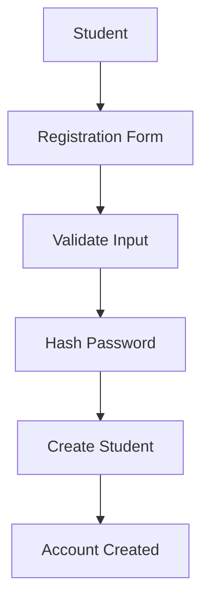
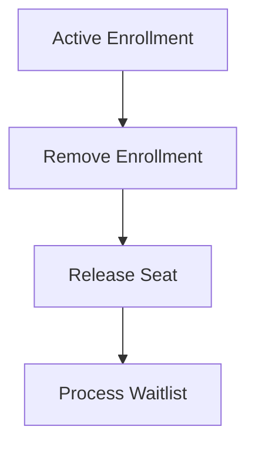
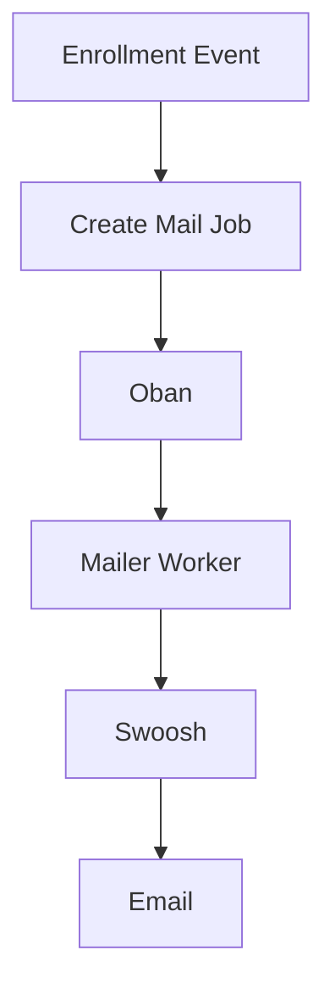
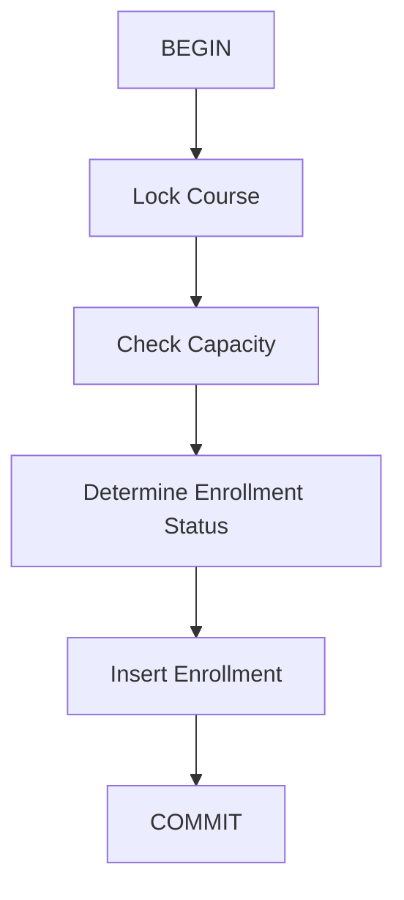

# Implemented Functionality

This document describes the requirements and functionality currently implemented in the Student Enrollment System.

---

# Student Registration

Students can create an account by providing their required information.

The registration flow:



Passwords are hashed using Bcrypt rather than being stored directly.

---

# Student Login

Registered students can authenticate through the login interface.

The system:

* Accepts student credentials
* Verifies the password
* Creates an authenticated session
* Redirects the student to the application

Invalid credentials result in an authentication error.

---

# Course Browsing

Students can view available courses.

Course information includes:

* Course title
* Description
* Course outline
* Start date
* End date
* Maximum capacity

---

# Course Enrollment

Students can enroll using their student identity and the selected course.

The system checks course capacity before creating an active enrollment.

### Available Seat

If:

```text
Active Enrollments < Maximum Capacity
```

the student receives:

```text
active
```

status.

### Course Full

If:

```text
Active Enrollments >= Maximum Capacity
```

the student receives:

```text
waitlisted
```

status.

---

# Enrollment Capacity

Course capacity is enforced through database-backed enrollment logic.

Example:

```text
Maximum Capacity = 3

Active:
Student A
Student B
Student C

Next Student
    ↓
WAITLISTED
```

The application calculates active enrollments rather than relying on a manually maintained count.

---

# FIFO Waitlist

Waitlisted students are processed in the order they joined.

Example:

```text
1. Student A
2. Student B
3. Student C
```

If a seat becomes available:

```text
Student A → ACTIVE
```

Student B remains next in the queue.

---

# Deregistration

Students can deregister from courses before the course begins.

The system handles two cases.

### Active Student



### Waitlisted Student

```text
Waitlisted Enrollment
      ↓
Remove Enrollment
```

No seat is released because the student was not occupying an active seat.

---

# Course Start Restriction

Once a course has started, students cannot deregister from it.

The course schedule is therefore part of the business logic.

```text
Current Date < Start Date
        ↓
Deregistration Allowed

Current Date >= Start Date
        ↓
Deregistration Rejected
```

---

# Oban Waitlist Worker

When an active enrollment is removed, an Oban worker processes the waitlist.

The worker:

1. Finds the next waitlisted enrollment.
2. Promotes the student.
3. Updates the enrollment status.
4. Handles the newly available seat.
5. Can trigger a notification job.

This allows waitlist processing to happen asynchronously.

---

# Mailer Background Job

The application supports background email processing using:

* **Oban** for job execution
* **Swoosh** for email composition and delivery

The basic flow is:



This prevents email delivery from blocking the enrollment request.

Potential notification events include:

* Enrollment confirmation
* Waitlist confirmation
* Waitlist promotion
* Course notifications

---

# Student Dashboard

Authenticated students can access a dashboard.

The dashboard provides access to their academic activity, including:

* Courses
* Enrollment status
* Assignments
* Assignment submissions

---

# Assignment Management

Students can access assignments belonging to their courses.

The assignment workflow includes:

```text
Course
   ↓
Assignment
   ↓
Student Opens Assignment
   ↓
Upload Submission
   ↓
Submission Stored
```

---

# File Uploads

The project supports assignment/submission file handling.

Uploaded files are processed as part of the submission workflow rather than requiring students to manually manage files outside the application.

---

# Database Relationships

The main relationships are:

```text
Student
  │
  ├── has_many Enrollments
  │
  └── has_many Courses through Enrollments

Course
  │
  ├── has_many Enrollments
  │
  └── has_many Assignments

Assignment
  │
  └── has_many Submissions
```

---

# Database Constraints

The database is used to enforce important data integrity rules.

The project uses concepts including:

* Foreign keys
* Unique indexes
* Database indexes
* Ecto changesets
* Transactions
* Row-level locking

---

# Transactional Enrollment

Enrollment is performed inside a database transaction.

The simplified process is:



If an operation fails, the transaction can roll back instead of leaving partially updated data.

---

# Authentication & Authorization

Protected functionality requires an authenticated student.

The application uses:

* Password authentication
* Bcrypt password hashing
* Session-based authentication
* Authentication plugs/hooks
* Protected routes

This prevents unauthenticated users from accessing student-specific functionality.

---

# Phoenix LiveView

The UI uses Phoenix LiveView for interactive functionality.

LiveView is used for areas such as:

* Authentication interfaces
* Course views
* Enrollment interactions
* Student dashboard
* Assignment-related interactions

This allows server-side state and UI updates without requiring a traditional frontend SPA.

---

# Error Handling

The application handles errors around operations such as:

* Invalid login credentials
* Invalid enrollment
* Full courses
* Invalid course operations
* Unauthorized access
* Invalid submissions
* Database operation failures

The system uses changesets and transactional operations to keep invalid data from being persisted.

---

# Overall Functional Flow

The complete system can be summarized as:

```mermaid 
flowchart TD
    A["Student"] --> B["Registration"]
    B --> C["Login"]
    C --> D["Browse Courses"]
    D --> E["Select Course"]
    E --> F["Check Capacity"]

    F -->|Available| G["ACTIVE"]
    F -->|Full| H["WAITLISTED"]

    G --> I["Dashboard"]
    I --> J["Assignments"]
    J --> K["Submission"]

    G --> L["Active Student Leaves"]
    L --> M["Oban Worker"]
    M --> N["Next Student Promoted"]
    N --> O["Mailer Job"]
    O --> P["Swoosh"]
    P --> Q["Email"]```

---

