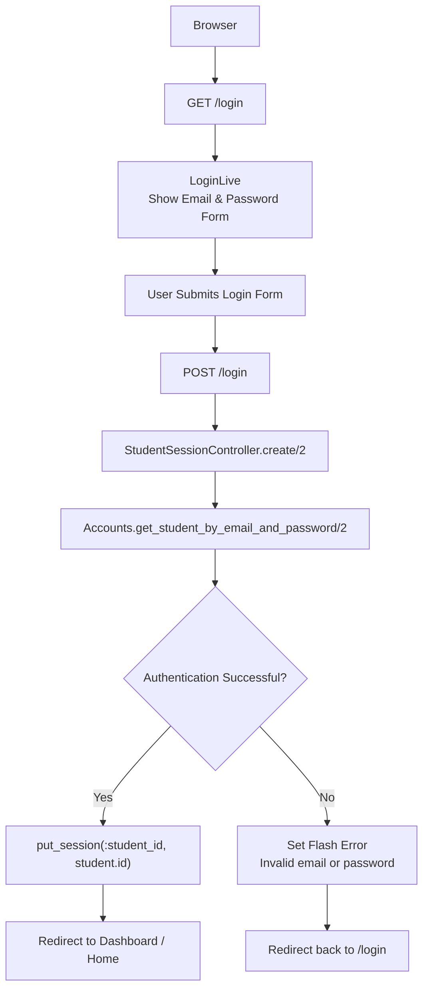

```mermaid

flowchart TD
    A[Browser] --> B[GET /login]

    B --> C[LoginLive<br/>Show Email & Password Form]

    C --> D[User Submits Login Form]

    D --> E[POST /login]

    E --> F[StudentSessionController.create/2]

    F --> G[Accounts.get_student_by_email_and_password/2]

    G --> H{Authentication Successful?}

    H -->|Yes| I["put_session(:student_id, student.id)"]
    I --> J[Redirect to Dashboard / Home]

    H -->|No| K["Set Flash Error<br/>Invalid email or password"]
    K --> L[Redirect back to /login]
```